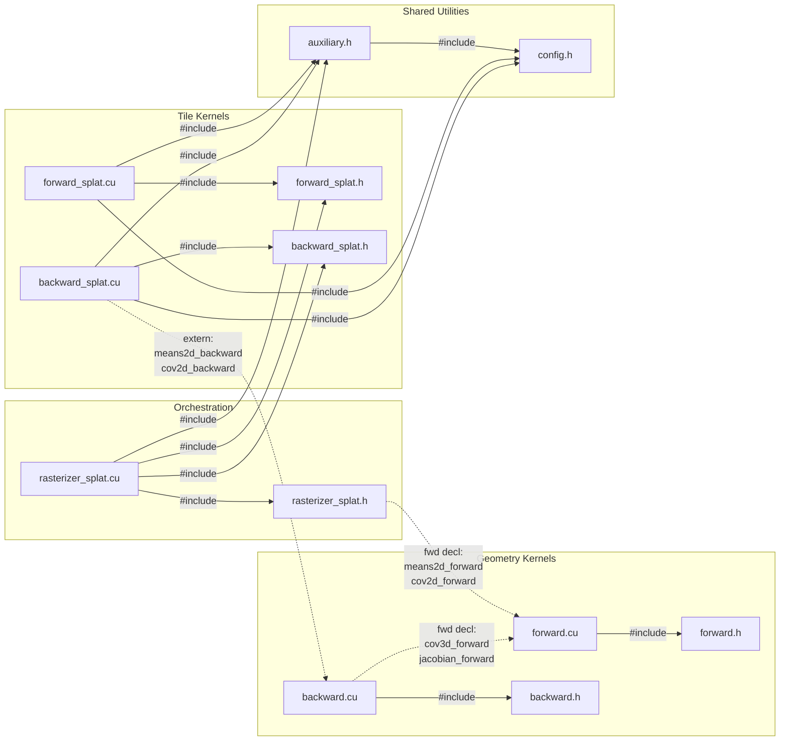

# cov3d_cuda

This folder contains a tile-based, wave-optics-aware 3D Gaussian splatting rasterizer implemented in CUDA. Extends the standard 3DGS pipeline to render complex-valued (amplitude + phase) fields instead of RGB images, enabling coherent wave propagation through splatted Gaussians.

## Structure

```
cov3d_cuda/
├── binding.cpp              # PYBIND11 module: registers all C++/CUDA ops as Python callables
├── setup.py                 # setuptools build config (CUDAExtension)
├── install.py               # Build entry point (calls setup_glm + setup.py)
├── setup_glm.py             # Downloads GLM 0.9.9.8 into third_party/glm/
├── python_import.py         # Python-side autograd Function wrappers and convenience APIs
│
├── wave_rasterizer/         # Core tile-based rasterizer
│   ├── config.h             # Compile-time constants (tile size, cutoffs, max channels/planes)
│   ├── auxiliary.h          # Device helpers: frustum test, rect computation, transforms, attenuation
│   ├── forward.h / forward.cu
│   │     Geometry kernels (no tiling):
│   │       - compute_cov3d_forward     (quat + scale → 3×3 covariance)
│   │       - compute_jacobian_forward  (projection Jacobian with FOV clamping)
│   │       - compute_cov2d_forward     (J·W·Σ·Wᵀ·Jᵀ + diagonal offset)
│   │       - compute_means2d_forward   (perspective projection)
│   │       - invert_cov2d_forward      (2×2 matrix inversion)
│   ├── backward.h / backward.cu
│   │     Gradient kernels for all geometry ops above, including chain-ruled
│   │     cov2d backward through saved intermediates (J, cov3D, W, JW).
│   ├── forward_splat.h / forward_splat.cu
│   │     Tile-based forward pass:
│   │       - preprocessGaussiansKernel  (radius, tile-touch count via eigenvalues)
│   │       - renderTileKernel           (front-to-back alpha compositing of complex fields)
│   ├── backward_splat.h / backward_splat.cu
│   │     Tile-based backward pass:
│   │       - renderBackwardTileKernel   (back-to-front gradient accumulation)
│   │       - preprocess()               (chains 2D gradients back to 3D params)
│   └── rasterizer_splat.h / rasterizer_splat.cu
│         Orchestration layer:
│           - CudaMemoryManager          (singleton buffer pool for geom/binning/image state)
│           - Rasterizer::forward()      (frustum cull → preprocess → CUB sort → tile render)
│           - Rasterizer::backward()     (tile backward → geometry backward)
│           - Key-value generation with depth-based sorting (duplicateWithKeysKernel)
│           - Tile range identification (identifyTileRangesKernel)
│
└── third_party/
    └── glm/                 # GLM 0.9.9.8 (header-only math library, auto-downloaded by setup_glm.py)
```

**Wave-based splatting**: Unlike standard 3DGS which composites RGB color, this rasterizer composites complex-valued fields per plane.
Each Gaussian carries amplitude (`colours`), phase (`phase`), opacity, and a probability distribution over depth planes (`plane_probs`). The rendered output is a complex tensor of shape `(P, C, H, W)` where P = number of planes, C = number of channels.

**Tile-based rendering**: The image is divided into 16×16 tiles. Gaussians are binned into tiles via CUB radix sort on `(tile_id, depth)` keys. Each tile processes its Gaussians front-to-back with early termination when transmittance drops below threshold.

## File Dependencies

Solid lines = `#include`. Dashed lines = function calls via `extern` / forward declaration.



## Python API (`python_import.py`)

```python
from cov3d_cuda.python_import import (
    compute_cov3d_cuda,      # quat + scale → 3D covariance
    compute_jacobian_cuda,   # projection Jacobian
    compute_cov2d_cuda,      # full 2D covariance pipeline
    compute_means2d_cuda,    # 3D → 2D projection
    invert_cov2d_cuda,       # 2×2 inverse
    splat_tile_cuda,         # full rasterization (forward + backward)
)
```

All splatting and geometry functions are wrapped in `torch.autograd.Function` with custom CUDA backward passes.
